# OpenDAoC Bot System - UML Class Diagram

```mermaid
classDiagram
    %% ============================
    %% Core Bot Classes
    %% ============================
    class GameBot {
        +GamePlayer Owner
        +string ClassName
        +string InternalID
        +byte ClassId
        +byte RaceId
        +byte GenderId
        +long DatabaseID
        +BotSpec BotSpec
        +PlayerDeck RandomNumberDeck
        +List~Style~ StylesChain
        +List~Spell~ CrowdControlSpells
        +List~Spell~ BoltSpells
        +Spell HealBig
        +Spell HealInstant
        +Spell HealGroup
        +void Delete()
        +bool AddToWorld()
        +void SortSpells()
        +void SortStyles()
        +void EquipBot()
        +void Shade(bool state)
        +int CalculateMaxHealth(int level, int constitution)
        +int CalculateMaxMana(int level, int manaStat)
        +double WeaponDamageWithoutQualityAndCondition(DbInventoryItem weapon)
    }

    class IGamePlayer {
        <<interface>>
        +IPacketLib Out
        +GameClient Client
        +string InternalID
        +ICharacterClass CharacterClass
        +Group Group
        +Guild Guild
        +IGameInventory Inventory
        +AttackComponent AttackComponent
        +StyleComponent StyleComponent
        +EffectListComponent EffectListComponent
        +PlayerDeck RandomNumberDeck
        +int Strength
        +int Dexterity
        +int Quickness
        +int Intelligence
        +int Health
        +int Mana
        +int Endurance
        +eRealm Realm
        +byte Level
        +void Notify(DOLEvent e, object sender)
        +int GetModified(eProperty property)
        + SpellLine GetSpellLine(string keyname)
        +bool HasSpecialization(string keyName)
        +int GetModifiedSpecLevel(string keyName)
        +void DisableSkill(Skill skill, int duration)
        +void Stealth(bool goStealth)
        +bool Sprint(bool state)
        +void CommandNpcRelease()
        +bool IsWithinRadius(GameObject obj, int radius)
    }

    GameBot ..|> IGamePlayer : implements
    GameBot --|> GameNPC : inherits

    %% ============================
    %% Bot Management
    %% ============================
    class BotManager {
        +const int MAX_BOTS_PER_PLAYER = 15
        +const int FOLLOW_DISTANCE = 150
        +const int MAX_FOLLOW_DISTANCE = 400
        +static GameBot CreateBot(GamePlayer owner, string name, byte classId, byte raceId, byte genderId)
        +static bool SpawnBot(GameBot bot)
        +static bool RemoveBot(GameBot bot)
        +static void DespawnBot(GameBot bot)
        +static void DeleteBot(GameBot bot)
        +static IEnumerable~GameBot~ GetBotsForOwner(GamePlayer owner)
        +static IEnumerable~GameBot~ GetSavedBotsForOwner(GamePlayer owner)
        +static GameBot LoadBotByName(GamePlayer owner, string botName)
        +static GameBot GetBotByName(GamePlayer owner, string botName)
        +static string GetClassNameById(byte classId)
        +static void RespawnBotsOnLogin(GamePlayer owner)
    }

    %% ============================
    %% Bot Command System
    %% ============================
    class BotCommand {
        +void OnCommand(GameClient client, string[] args)
        -void HandleCreate(GameClient client, string[] args)
        -void HandleSpawn(GameClient client, string[] args)
        -void HandleList(GameClient client)
        -void HandleDelete(GameClient client, string[] args)
        -void HandleDespawn(GameClient client, string[] args)
        -void HandleInvite(GameClient client, string[] args)
        -void HandleFollow(GameClient client, string[] args)
        -void HandleStay(GameClient client, string[] args)
        -void HandleHold(GameClient client, string[] args)
        -void HandleResume(GameClient client, string[] args)
    }

    BotCommand -- BotManager : uses

    %% ============================
    %% Bot AI - Brain System
    %% ============================
    class BotBrain {
        +GameBot BotBody
        +bool IsHealer
        +ConcurrentDictionary~GameLiving, AggroAmount~ AggroList
        +FSM FSM
        +int ThinkInterval
        +void AddToAggroList(GameLiving living, long aggroAmount)
        +void ForceAddToAggroList(GameLiving living, long aggroAmount)
        +void RemoveFromAggroList(GameLiving living)
        +void ClearAggroList()
        +void AttackMostWanted()
        +void Think()
        +void Notify(DOLEvent e, object sender, EventArgs args)
        +bool CheckSpells(eCheckSpellType type)
        +bool CheckHeals()
        +void CheckOffensiveAbilities()
        +void ConvertDamageToAggroAmount(GameLiving attacker, int damage)
        +void OnAttackedByEnemy(AttackData ad)
    }

    class AggroAmount {
        +long Base
        +long Effective
    }

    BotBrain --> AggroAmount : contains
    BotBrain --> GameBot : manages
    BotBrain ..> FSM : controls
    BotBrain ..> BotState_Idle : creates
    BotBrain ..> BotState_Follow : creates
    BotBrain ..> BotState_Aggro : creates
    BotBrain ..> BotState_Passive : creates

    class ABrain {
        <<abstract>>
        +GameObject Body
        +virtual void Think()
        +virtual bool Stop()
    }

    BotBrain --|> ABrain : inherits

    %% ============================
    %% FSM State Pattern
    %% ============================
    class FSM {
        +void Add(FSMState state)
        +void SetCurrentState(eFSMStateType type)
        +void Think()
        +void KillFSM()
        +FSMState GetCurrentState()
    }

    class FSMState {
        <<abstract>>
        +eFSMStateType StateType
        +virtual void Enter()
        +virtual void Exit()
        +virtual void Think()
    }

    class BotState {
        +protected BotBrain _brain
        +BotState(BotBrain brain)
        +override void Enter()
        +override void Exit()
        +override void Think()
    }

    class BotState_Idle {
        +override void Enter()
        +override void Think()
    }

    class BotState_Follow {
        +override void Enter()
        +override void Exit()
        +override void Think()
    }

    class BotState_Aggro {
        +override void Enter()
        +override void Exit()
        +override void Think()
    }

    class BotState_Passive {
        +override void Enter()
        +override void Think()
    }

    FSM o-- FSMState : manages
    FSMState <|-- BotState : extends
    BotState <|-- BotState_Idle : extends
    BotState <|-- BotState_Follow : extends
    BotState <|-- BotState_Aggro : extends
    BotState <|-- BotState_Passive : extends

    %% ============================
    %% Dummy Client/Packet Library
    %% ============================
    class BotDummyClient {
        +DbAccount Account
        +BotDummyClient()
    }

    class BotDummyPacketLib {
        +int BowPrepare
        +int BowShoot
        +int OneDualWeaponHit
        +int BothDualWeaponHit
        +byte GetPacketCode(eServerPackets packetCode)
        +void SendTCP(GSTCPPacketOut packet)
        +void SendMessage(string msg, eChatType type, eChatLoc loc)
        +void SendObjectCreate(GameObject obj)
        +void SendObjectUpdate(GameObject obj)
        +void SendObjectDelete(GameObject obj)
        +void SendChangeTarget(GameObject newTarget)
    }

    class IPacketLib {
        <<interface>>
        +byte GetPacketCode(eServerPackets packetCode)
        +void SendMessage(string msg, eChatType type, eChatLoc loc)
        +void SendTCP(GSTCPPacketOut packet)
    }

    BotDummyClient --|> GameClient : inherits
    BotDummyPacketLib ..|> IPacketLib : implements
    GameBot *-- BotDummyClient : has
    GameBot *-- BotDummyPacketLib : has

    %% ============================
    %% Equipment & Inventory
    %% ============================
    class BotEquipment {
        +static void SetMeleeWeapon(IGamePlayer player, eObjectType weapType, eHand hand, eDamageType damageType)
        +static void SetRangedWeapon(IGamePlayer player, eObjectType weapType)
        +static void SetShield(IGamePlayer player, int shieldSize)
        +static void SetArmor(IGamePlayer player, eObjectType armorType)
        +static void SetInstrument(IGamePlayer player, eObjectType weapType, eInventorySlot slot, eInsrumentType instrumentType)
        +static void SetJewelry(IGamePlayer player)
        +static void SetWeaponROG(GameLiving living, eRealm realm, eCharacterClass charClass, byte level...)
        +static void SetArmorROG(GameLiving living, eRealm realm, eCharacterClass charClass, byte level...)
    }

    class BotInventory {
        +BotInventory()
        -eInventorySlot GetValidInventorySlot(eInventorySlot slot)
    }

    BotInventory --|> GameLivingInventory : inherits
    BotEquipment ..> GameBot : equips

    %% ============================
    %% Database Objects
    %% ============================
    class BotDatabase {
        +static bool SaveBot(GameBot bot)
        +static GameBot LoadBot(GamePlayer owner, long botId)
        +static GameBot LoadBotByName(GamePlayer owner, string botName)
        +static List~BotProfile~ GetSavedBots(GamePlayer owner)
        +static List~BotProfile~ GetActiveBots(GamePlayer owner)
        +static bool DeleteBot(GameBot bot)
        +static void SetBotActive(long botId, bool active)
        +static void SaveBotSettings(GameBot bot)
        +static void LoadBotSettings(GameBot bot)
    }

    class BotProfile {
        +long BotId
        +string OwnerCharacterID
        +string Name
        +byte ClassId
        +byte RaceId
        +byte GenderId
        +byte Level
        +bool IsActive
    }

    class BotSettings {
        +long BotId
        +short FollowDistance
        +string CombatMode
        +byte HealThreshold
        +string PreferredTarget
    }

    BotProfile --|> DataObject : inherits
    BotSettings --|> DataObject : inherits
    BotDatabase ..> BotProfile : manages
    BotDatabase ..> BotSettings : manages
    BotManager ..> BotDatabase : uses

    %% ============================
    %% Player Deck (Random Number)
    %% ============================
    class PlayerDeck {
        -List~int~ _deck
        -int _index
        -Random _random
        +PlayerDeck()
        +void Reset()
        -void Shuffle()
        +int GetInt(int max)
        +double GetDouble()
    }

    GameBot *-- PlayerDeck : uses

    %% ============================
    %% Specification System
    %% ============================
    class BotSpec {
        +eObjectType WeaponOneType
        +eObjectType WeaponTwoType
        +eWeaponDamageType DamageType
        +eSpecType SpecType
        +bool Is2H
        +List~BotSpecLine~ SpecLines
        +static string SpecName
        +void Add(string spec, uint cap, float ratio)
        +static BotSpec GetSpec(eCharacterClass charClass, eSpecType spec)
    }

    class BotSpecLine {
        +string Spec
        +uint SpecCap
        +float levelRatio
        +BotSpecLine(string spec, uint cap, float ratio)
    }

    class eSpecType {
        <<enumeration>>
        MatterCab
        BodyCab
        SpiritCab
        RejuvCleric
        EnhanceCleric
        SmiteCleric
        OneHanded
        TwoHanded
        DualWield
        Ranged
        Instrument
        ...
    }

    GameBot *-- BotSpec : defines specialization
    BotSpec o-- BotSpecLine : contains
    BotSpec ..> eSpecType : uses

    %% Class-specific specification subclasses
    namespace Albion.Specs {
        class ArmsmanBotSpec { }
        class PaladinBotSpec { }
        class ClericBotSpec { }
        class WizardBotSpec { }
        class SorcererBotSpec { }
        class TheurgistBotSpec { }
        class MinstrelBotSpec { }
        class ScoutBotSpec { }
        class InfiltratorBotSpec { }
        class FriarBotSpec { }
        class MercenaryBotSpec { }
        class CabalistBotSpec { }
        class ReaverBotSpec { }
    }

    namespace Hibernia.Specs {
        class HeroBotSpec { }
        class ChampionBotSpec { }
        class WardenBotSpec { }
        class DruidBotSpec { }
        class BardBotSpec { }
        class NightshadeBotSpec { }
        class RangerBotSpec { }
        class ValewalkerBotSpec { }
        class EnchanterBotSpec { }
        class MentalistBotSpec { }
        class EldritchBotSpec { }
        class BlademasterBotSpec { }
    }

    namespace Midgard.Specs {
        class WarriorBotSpec { }
        class BerserkerBotSpec { }
        class SavageBotSpec { }
        class HunterBotSpec { }
        class HealerBotSpec { }
        class ShamanBotSpec { }
        class RunemasterBotSpec { }
        class BonedancerBotSpec { }
        class SpiritmasterBotSpec { }
        class ThaneBotSpec { }
        class ShadowbladeBotSpec { }
        class SkaldBotSpec { }
    }

    BotSpec <|-- ArmsmanBotSpec : extended by
    BotSpec <|-- PaladinBotSpec : extended by
    BotSpec <|-- ClericBotSpec : extended by
    BotSpec <|-- HeroBotSpec : extended by
    BotSpec <|-- ChampionBotSpec : extended by
    BotSpec <|-- WardenBotSpec : extended by
    BotSpec <|-- WarriorBotSpec : extended by
    BotSpec <|-- BerserkerBotSpec : extended by
    BotSpec <|-- SavageBotSpec : extended by
    BotSpec <|-- HunterBotSpec : extended by
    BotSpec <|-- HealerBotSpec : extended by
    BotSpec <|-- ShamanBotSpec : extended by
    BotSpec <|-- RunemasterBotSpec : extended by
    BotSpec <|-- BonedancerBotSpec : extended by
    BotSpec <|-- SpiritmasterBotSpec : extended by
    BotSpec <|-- ThaneBotSpec : extended by
    BotSpec <|-- ShadowbladeBotSpec : extended by
    BotSpec <|-- SkaldBotSpec : extended by
    BotSpec <|-- WizardBotSpec : extended by
    BotSpec <|-- SorcererBotSpec : extended by
    BotSpec <|-- TheurgistBotSpec : extended by
    BotSpec <|-- MinstrelBotSpec : extended by
    BotSpec <|-- ScoutBotSpec : extended by
    BotSpec <|-- InfiltratorBotSpec : extended by
    BotSpec <|-- FriarBotSpec : extended by
    BotSpec <|-- MercenaryBotSpec : extended by
    BotSpec <|-- CabalistBotSpec : extended by
    BotSpec <|-- ReaverBotSpec : extended by
    BotSpec <|-- BardBotSpec : extended by
    BotSpec <|-- DruidBotSpec : extended by
    BotSpec <|-- NightshadeBotSpec : extended by
    BotSpec <|-- RangerBotSpec : extended by
    BotSpec <|-- ValewalkerBotSpec : extended by
    BotSpec <|-- EnchanterBotSpec : extended by
    BotSpec <|-- MentalistBotSpec : extended by
    BotSpec <|-- EldritchBotSpec : extended by
    BotSpec <|-- BlademasterBotSpec : extended by

    %% ============================
    %% Relationships Summary
    %% ============================
    
    note "Core Composition\nGameBot owns BotBrain for AI\nGameBot uses BotDummyClient/PacketLib for interface"
    note "Management\nBotManager is static singleton managing all bots\nCreates, spawns, removes bots from world\nInteracts with BotDatabase for persistence"
    note "Database Layer\nBotProfile stores basic bot info\nBotSettings stores behavior config\nBoth extend DataObject for ORM"
    note "AI System\nBotBrain extends ABrain with aggression mechanics\nFSM pattern for behavior states\nStates: Idle, Follow, Aggro, Passive"
```



## Architecture Overview

### Core Components

1. **GameBot** - Main bot class extending `GameNPC` and implementing `IGamePlayer`
   - Full player-like functionality for NPCs
   - Integrates with game systems (group, combat, inventory)

2. **BotManager** - Static manager class
   - Controls bot lifecycle (create, spawn, remove)
   - Up to 15 bots per player
   - Tracks active bots in memory

3. **BotBrain** - AI controller extending `ABrain`
   - Implements threat/aggro system
   - FSM-based behavior states
   - Spell casting and healing logic

4. **Specification System**
   - `BotSpec` defines class-specific specializations
   - Per-class spec files define stat distributions
   - 37 unique class specs across 3 realms

### Key Features

- **Player Control**: Bots implement `IGamePlayer` for full integration
- **Persistence**: Bot profiles saved to database (`bot_profiles`, `bot_settings`)
- **Equipment**: Auto-equips appropriate weapons/armor via `BotEquipment`
- **Command Interface**: `/bot` commands for player interaction
- **AI States**: Idle, Follow, Aggro, Passive behaviors
- **Healing System**: Intelligent group healing for healer bots

### Database Schema

```sql
bot_profiles (
    bot_id BIGINT PRIMARY KEY AUTO_INCREMENT,
    owner_character_id VARCHAR(255),
    name VARCHAR(64),
    class_id TINYINT,
    race_id TINYINT,
    gender_id TINYINT,
    level TINYINT,
    is_active BOOLEAN
)

bot_settings (
    bot_id BIGINT PRIMARY KEY,
    follow_distance SHORT,
    combat_mode VARCHAR(32),
    heal_threshold TINYINT,
    preferred_target VARCHAR(32)
)
```
